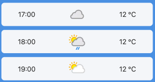
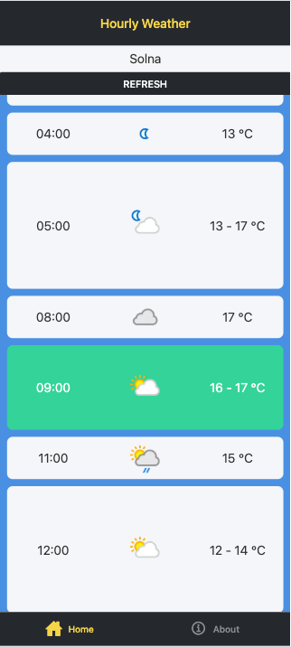

# OneDay Weather (Client)



Intentionally minimalist weather app that shows the current day's forecast, split into hourly blocks. Built with React Native and Expo and using the WeatherAPI.com API for data.



🔗 Live Demo: https://oneday-weather-client-web.onrender.com/

Demonstrates the use of Expo Router for structured navigation, integration of REST APIs in React Native and deployment of React Native Web with static hosting.

## Related Repo
- [OneDay Weather (Server)](https://github.com/JockeTS/oneday-weather-server)

Backend proxy used to securely access the WeatherAPI.com API.

## Setup / How to Run
```
npm install --global expo-cli
git clone https://github.com/JockeTS/weather-sensor-manager.git
cd oneday-weather-client
npm install
npx expo start
```

### Static Web Build
```
npx expo export --platform web
```
